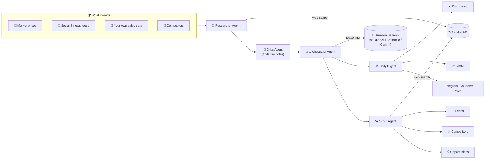
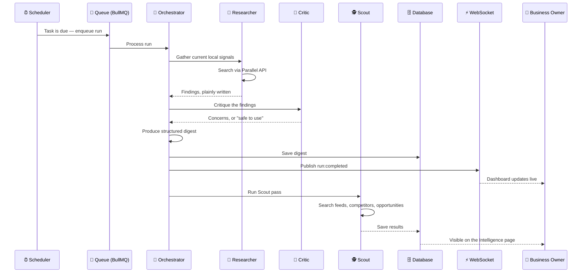

<div align="center">
  

  <p>
    
    
    
    
  </p>
</div>

<br/>

## 😔 The problem

Every morning, a small business owner has to guess. Will customers have money to spend today? Did fuel prices just eat into everyone's budget? Is that new shop down the road quietly taking their customers? Is anyone even talking about their business online — and if so, what are they saying?

Big corporations pay analysts and subscribe to expensive intelligence platforms to answer these questions. A shop owner in Akure, a salon in Lagos, a hardware store in Kano — they get none of that. They price by gut feeling. They restock by memory. They find out about a competitor's grand opening the week it happens, from a customer.

**That gap — between corporate-grade market intelligence and what a small business can actually access — is the whole problem Makit exists to close.**

## 💡 The solution

Makit is a background intelligence agent for small businesses. It runs quietly, on a schedule you choose, and reads what's actually happening in your market — the economy, local events, what people are saying online, what your competitors are up to, and whatever data you stream it yourself. Then it hands you one clear, honest answer: is today a good day to sell, and what should you do about it.

It is not a dashboard you have to remember to check. It's a colleague who already checked, and only interrupts you when there's a real decision to make.

### What it actually does, concretely

- 📋 **Daily digest** — a plain-language read on today's conditions: good, caution, or slow — with why, and one concrete action to take
- 🕵️ **Competitor intelligence** — real, named competitors near you, what they're doing well, and how to compete with each
- 💡 **Customer opportunities** — what people are actually saying they want, need, or struggle with in your market, grounded in real search results, with a specific action attached to each one
- 📡 **Live feeds** — recent, relevant mentions of businesses like yours, pulled from the open web
- 🔌 **Stream your own data** — a webhook per Intelligence, so your own sales numbers, foot traffic, or notes get factored in
- 🧩 **Bring your own MCP server** — plug in a WhatsApp MCP for notifications, or anything else that exposes tools, and give your agent new capabilities
- 🌍 **Multi-language** — English, Yoruba, Hausa, and Igbo, both in the interface and in the agent's own writing
- ⚡ **Real-time** — a WebSocket layer pushes updates to your dashboard the moment a run starts or finishes, no refreshing

## 🧠 How it works

Every Intelligence runs the same pipeline: research, critique, decide, then a separate pass to scout for feeds, competitors, and opportunities.



And here's the actual sequence of one scheduled run, start to finish:



## 🏗️ The brains and the eyes: how Bedrock and Parallel fit in

Makit deliberately separates *thinking* from *seeing*, and neither one is hard-wired:

- **🧠 Amazon Bedrock is the brains, and the recommended default.** Every agent — Researcher, Critic, Orchestrator, Scout — is a real [Strands Agents SDK](https://github.com/strands-agents) `Agent`, and Bedrock is the model provider Strands itself defaults to. Makit supports a **Bedrock API key** (a simple bearer token, same one-string setup as every other provider) *or* the server's own AWS credentials — meaning a business can use Bedrock with **zero keys configured at all** when Makit itself is deployed under an IAM role, which is exactly how [Bedrock AgentCore](https://aws.amazon.com/bedrock/agentcore/) deployment works. OpenAI, Anthropic, and Google Gemini are also fully supported, selectable per business from Settings — no lock-in.
- **👁️ Parallel is the eyes.** Every time an agent needs to know something happening in the real world right now — a fuel price, a competitor's new opening, what people are saying in a local forum — it calls the [Parallel Search API](https://parallel.ai), which returns pre-compressed, citation-aware web results built specifically for grounding an LLM, not a raw search-engine dump. This is the *only* web-search integration in the codebase; the Researcher and Scout agents share the exact same tool, not two separate implementations.

Every model call goes through Strands' native features, not custom glue code: `structuredOutputSchema` (Zod) validates every digest and Scout result automatically, and sub-agents are attached to the Orchestrator as tools via Strands' own `Agent`-as-tool support — the Orchestrator's model decides when to call the Researcher or Critic, Makit doesn't hard-code that control flow.

## 🚀 Installation & usage

### Run it locally — no cloud account required

```bash
git clone <this-repo>
cd makit
npm install
npm start
```

Open `http://localhost:8080`. This runs against an in-memory store by default — the full app (auth, Intelligence creation, webhooks, scheduling) works with zero external services. You'll need a real model provider key to see an agent run actually complete.

### Run it with Docker (Mongo + Redis included)

```bash
cp .env.example .env
# set JWT_SECRET and ENCRYPTION_KEY in .env — see the file for how to generate them
docker compose up
```

This brings up Makit, MongoDB, and Redis together, on port `8080`.

### Using it

1. **Register**, then go to **Settings** and add a model provider key — Bedrock is recommended
2. *(Optional)* Add a **Parallel** key for live web search
3. Click **New Intelligence**, tell it about your business, pick a model, and set a schedule
4. Watch your first digest arrive — on the dashboard, live, the moment it finishes
5. *(Optional)* Stream your own sales data to its webhook — code samples for curl, JavaScript, and Python are built into the Intelligence page
6. *(Optional)* Connect your own MCP server in Settings to give the agent new capabilities

## 👥 Who is this for

- **Small and growing businesses** — especially in markets where currency volatility, inflation, and informal competition make gut-feel pricing genuinely risky
- **Business consultants and agencies** who want to hand every client their own always-on market analyst
- **Developers** who want to embed real market intelligence into another product via the webhook, the API, or by connecting their own MCP server
- **Anyone building on Strands Agents SDK** looking for a real, production-shaped reference for multi-agent orchestration, structured output, and MCP integration

## 🏭 Already in production

Makit's core intelligence engine isn't just a demo — it's the same engine already running inside **[ZionMatrix](https://zionmatrix.com)**, an AI-powered business operating system for African SMEs, where it powers the **Market Weather** module inside ZionMatrix's Telo agent. Makit is that engine, rebuilt as its own standalone, open product.

## 🗺️ What's next

**Planned:**
- 📄 PDF export of digests and intelligence reports
- 🗣️ Voice — ask a task a question out loud, get a spoken answer back
- 💬 An in-app chat interface to ask a running Intelligence follow-up questions directly
- 📈 Richer historical charts — trend lines across weeks of digests, not just the day's read
- 🧑‍🤝‍🧑 Team accounts — more than one person per business
- 🌐 More languages, with native-speaker review

**Honest, current limitations — not hidden, being worked on:**
- The four supported languages are AI-translated, not yet reviewed by native speakers
- UI translation currently covers the interface chrome, not every field label on every page
- Docker deployment is logically reviewed and env-var-checked, but hasn't been build-tested in a real Docker environment yet
- No end-to-end run has yet been observed against a live, working model key in the environment this was built in

## 🤝 Contributing

Contributions are welcome — issues, pull requests, translation reviews, all of it. This is meant to be a real, growing project, not a closed one.

## 📄 License

MIT — see [`LICENSE`](./LICENSE). Free to use, including in production, including commercially.
